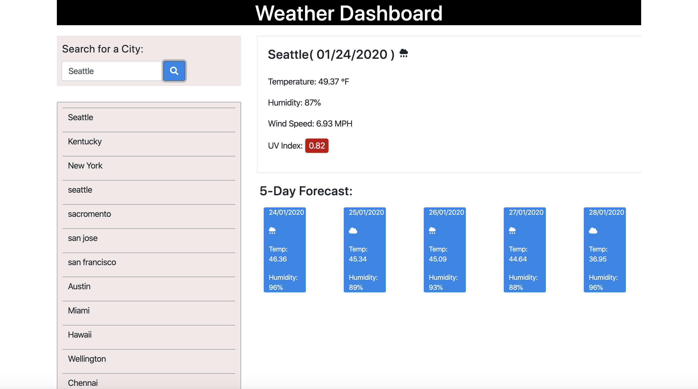

# weather-dashboard
Weather dashboard application

## Description:

 This is a weather dashboard application with search functionality to find current weather conditions and the future weather outlook for multiple cities. 
 
 The application is built using OpenWeather API to retrieve weather data for cities.

 

## Usage:

1. The user enter the city name in the search field.

2. The application displays the following:

- City

- Date

- Icon image (visual representation of weather conditions)

- Temperature

- Humidity

- Wind speed

- UV index

3.  The application includes a Search History so that users can view their past search terms.

4. The application also includes a 5-Day Forecast below the current weather conditions. Each day for the 5-Day Forecast displays the following:

- Date

- Icon image (visual representation of weather conditions)

- Temperature

- Humidity

## Technologies:

HTML 5,CSS 3, jQuery 3.4.1

## Screenshots:

